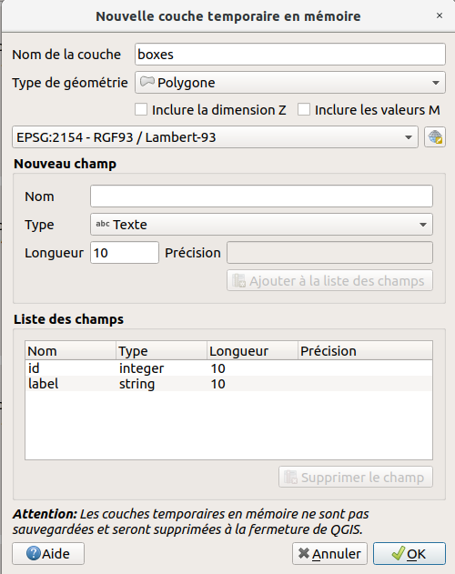
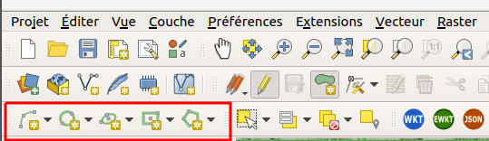
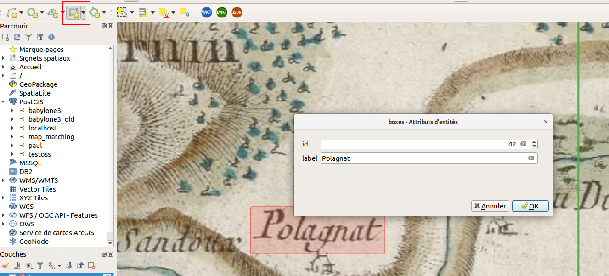
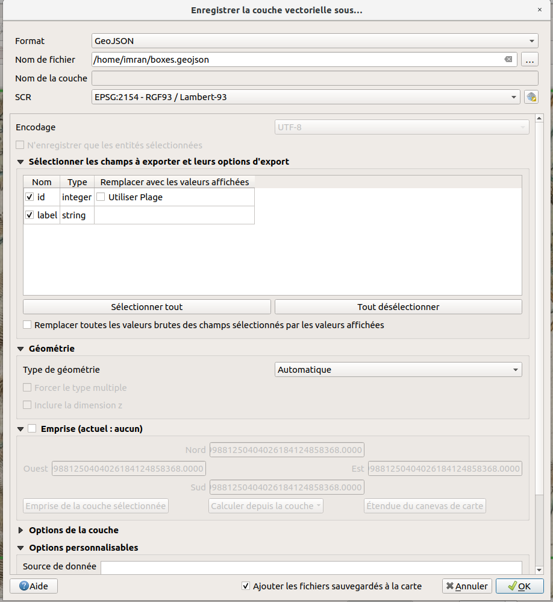

# Créer un geojson de rectangles (boites de texte) compatible avec le format attendu par le script `cassini_to_icdar.py`.

Ce script prend en entrée un tif géoréférencé et un fichier geojson de boites de texte donnant les coordonnées des textes du tif, et sort des imagettes du tif découpé suivant une taille fixée, ainsi que les coordonnées des boites de texte pour chaque imagette en coordonnées images, dans le format ICDAR.

Pour créer un geojson compatible, on pourra utiliser QGIS :

## Créer une couche vecteur au bon format (id, label) :
Couche > Creer une couche > nouvelle couche temporaire en memoire

Type de géométrie -> Polygone
champs id -> entier
champs label -> texte

## Puis click droit sur la barre d'outils -> cocher "Numérisation de formes"

## Ajouter au moins un rectangle à partir de l'étendue

## Exporter en geojson

On peut alors continuer à éditer directement le geojson
